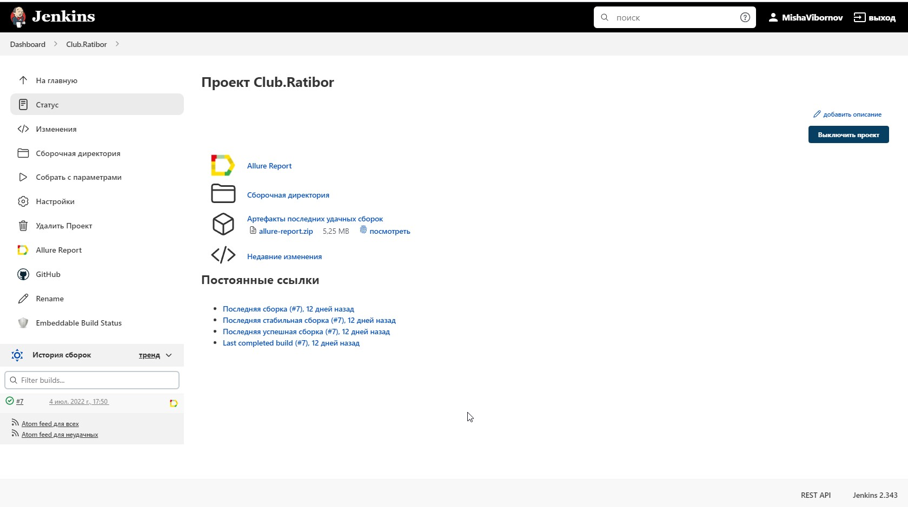
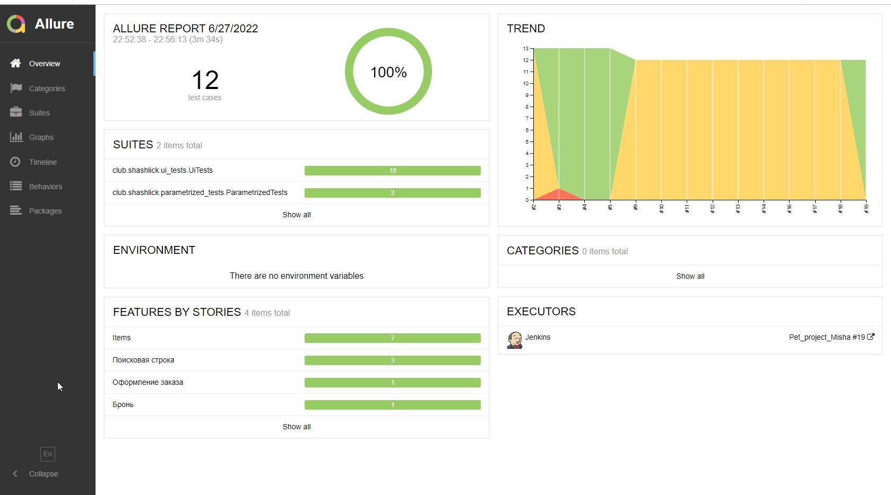
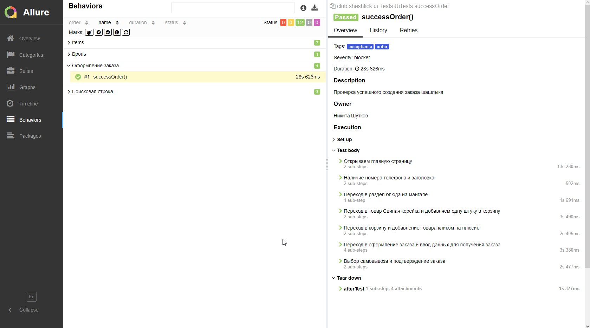
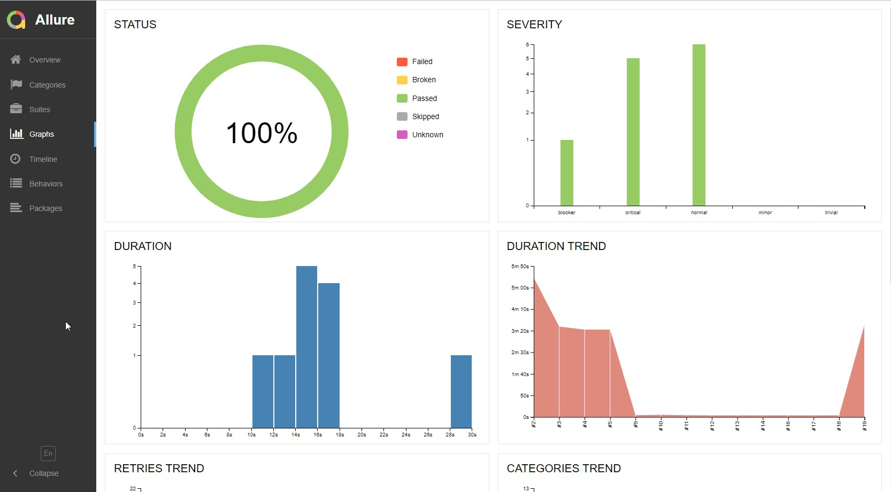
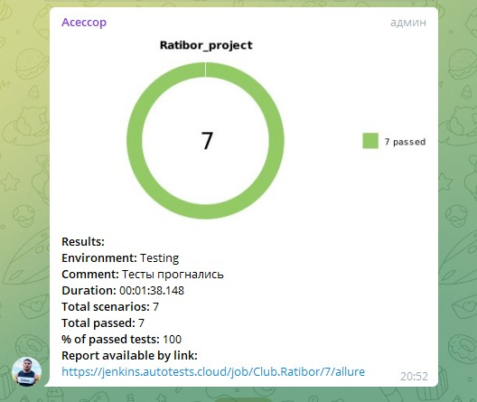
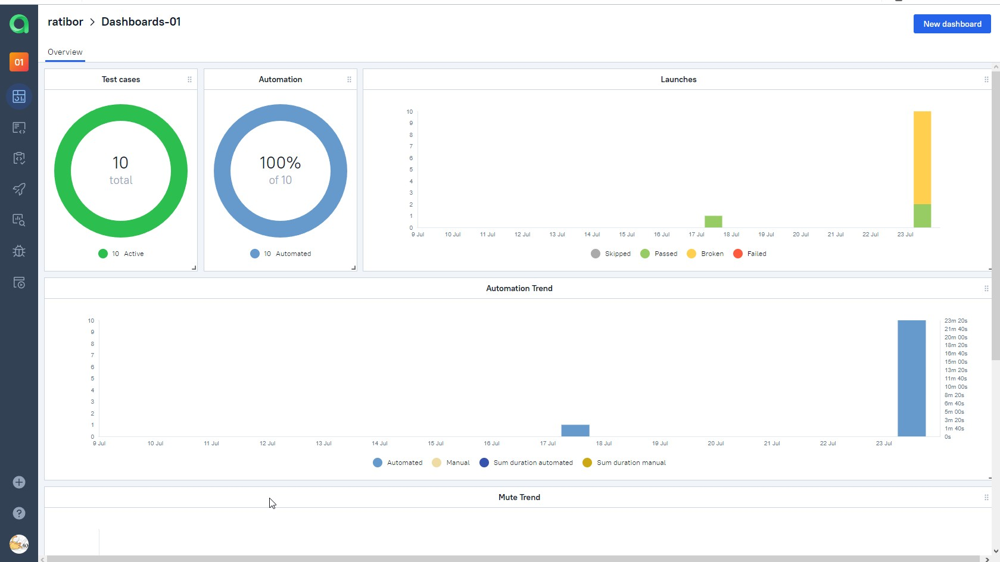
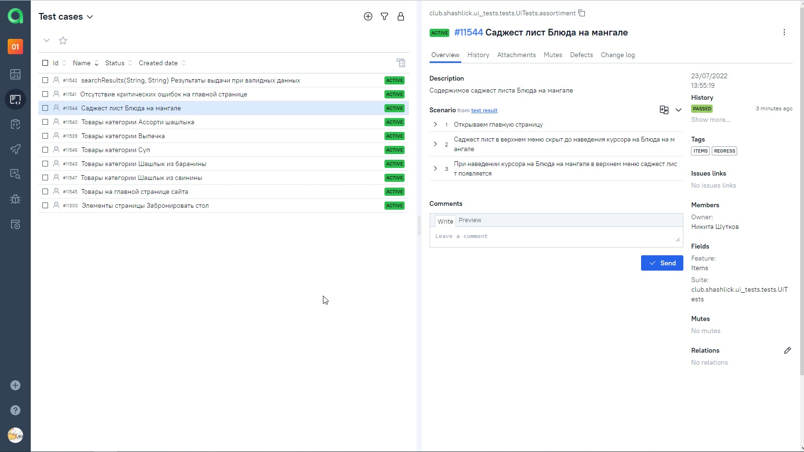
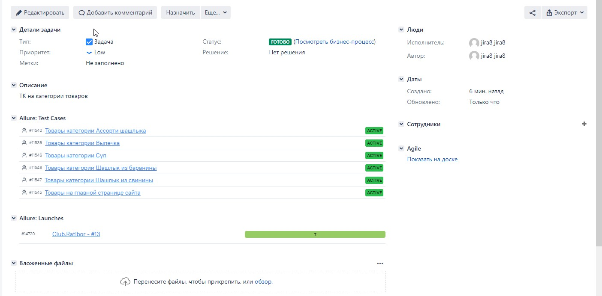
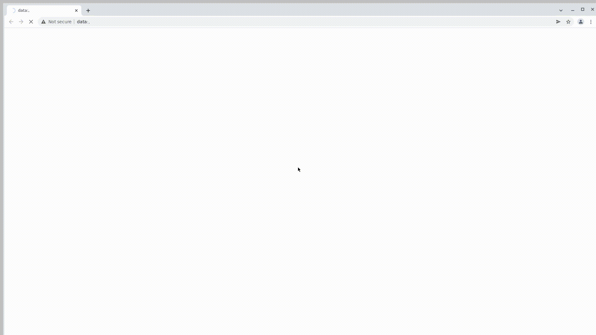

# Проект автоматизации тестирования сайта shashlik.club 🥩

##  Используемые инструменты

<p align="center">


</p>

## Краткая характеристика проекта
> ЯП для автотестов - <code>Java 11</code>
> 
> Библиотека <code>Selenide</code> в основе автотестов.
> 
> <code>JUnit 5</code> - основной фреймворк.
>
>  <code>Gradle</code> для сборки проекта.
>
> <code>Selenoid</code> выполняет запуск браузеров в контейнерах <code>Docker</code> (для удаленного запуска).
>
> <code>Allure</code> для визуализации результатов тестирования и степов.
>
> CI/CD - <code>Jenkins</code>.
> 
> Библиотека <code>Owner</code> - для гибкой настройки конфига
>
> После завершения прогона отправляются уведомления с помощью бота в <code>Telegram</code>.
> 
> Для запуска нужного сьюта используется гибкая система тэгов
> 


## Реализованные в рамках проекта сьюты
> Для удобства прогона автотестов все тест-кейсы поделены на сьюты с помощью кастомных тэгов (по критерию проверки функционала):
> 
> regress, acceptance 
> 
> booking - кейсы, связанные с бронированием стола
> 
> order - кейсы, связанные с оформлением заказа
> 
> items - кейсы, связанные с товарами
> 
> search - кейсы, связанные с поиском на сайте 


## Запуск UI web тестов
* Примечание - для запуска нужного сьюта вместо test в команду можно подставить необходимый tag (например, order)
<details>
<summary>Подробнее ...</summary>

### Локальный запуск тестов

```./gradlew clean test -Dclient=localBrowser -Dtype=ui```

### Локальный запуск тестов в Selenoid
<details>
<summary>Шаги запуска</summary>

>1. Создать файл с проперти
>> * путь указать ```./src/test/resources/config/remoteBrowser.properties```
>> * добавить данные в файл, пример( ```src/test/resources/config/exampleRemoteBrowser.properties``` )
>2. Запустить тесты
>>```./gradlew clean runTestsUi -Dclient=remoteBrowser -Dtype=ui```
</details>


### Удаленный запуск тестов в Jenkins
<details>
<summary>Шаги запуска</summary>

>1. Создать файл с проперти в Jenkins
>> * путь указать ```./src/test/resources/config/remoteBrowser.properties```
>> * добавить данные в файл, пример( ```src/test/resources/config/exampleRemoteBrowser.properties``` )
>2. Создать файл с настройками для Telegram в Jenkins
>> * путь указать ```./notifications/telegram_config.json```
>> * добавить данные в файл, пример(```./notifications/example_telegram_config.json```)
>3. Запустить тесты
>>```
>>clean
>>runTestsUi
>>-Dclient=remoteBrowser
>>-Dtype=ui
>>-Dthreads=3
>>```
</details>
</details>


# Пример запуска тестов Jenkins и отчеты
##  Главная страница сборки [Jenkins](https://jenkins.autotests.cloud/job/Club.Ratibor/)

<p align="center">
  
</p>

##  Отчет о результатах тестирования в Allure Report

### Главная страница Allure-отчета

<p align="center">

</p>

### Страница с тестами

<p align="center">

</p>

### Основной дашборд

<p align="center">

</p>

##  Уведомления в Telegram с использованием бота

> После прогона тестов бот, созданный в <code>Telegram</code>, автоматически обрабатывает и отправляет сообщение с отчетом в чат.
<p align="center">

</p>

##  Отчеты в TestOps

<p align="center">


</p>

##  Интеграция с Jira

<p align="center">

</p>

##  Пример запуска теста 

> К каждому тесту в отчете прилагается видео. Одно из таких видео представлено ниже.
<p align="center">
  
</p>
